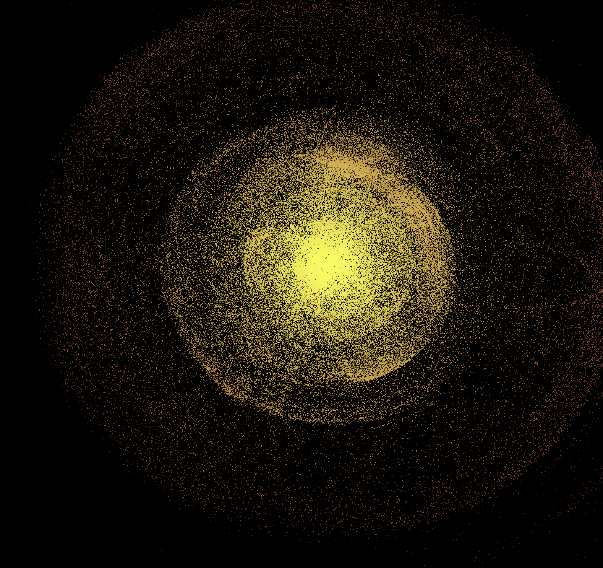
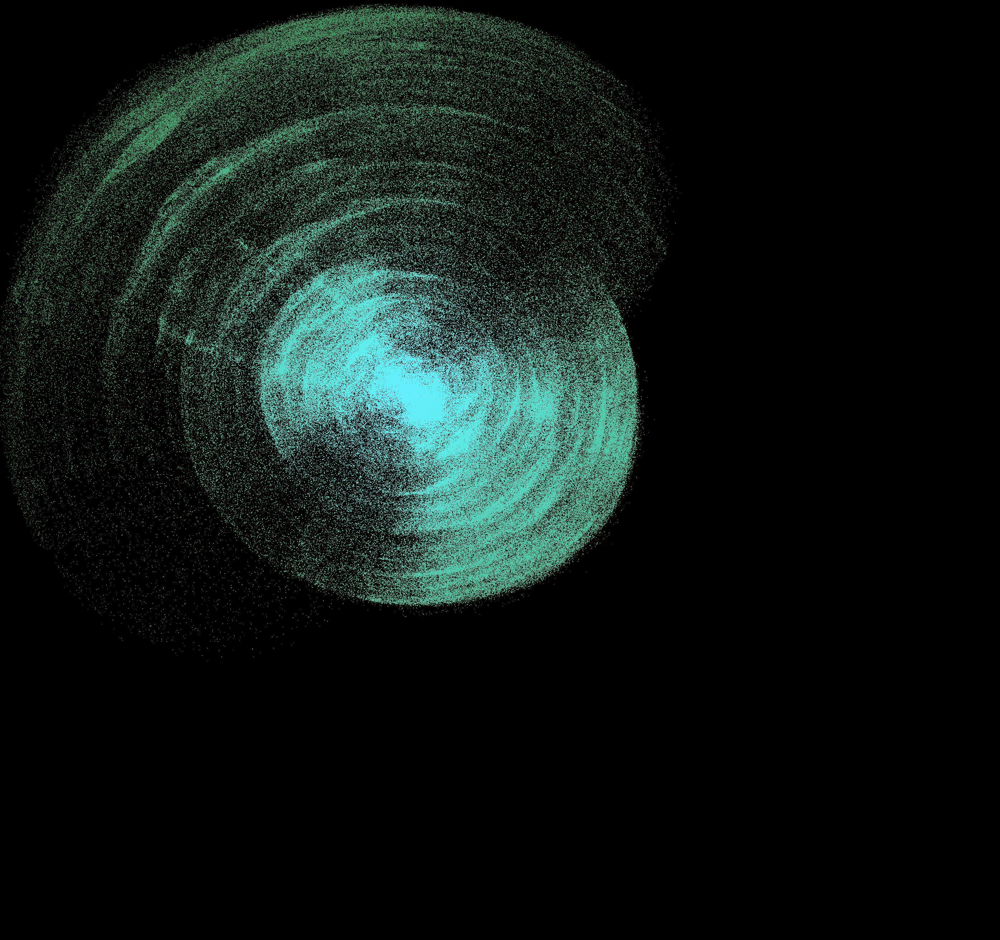
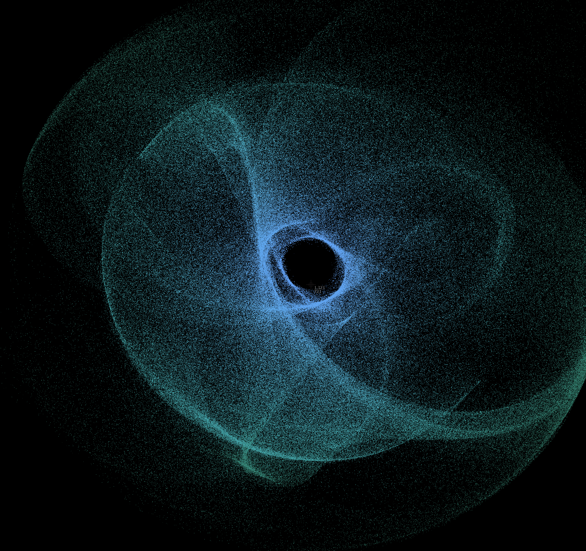
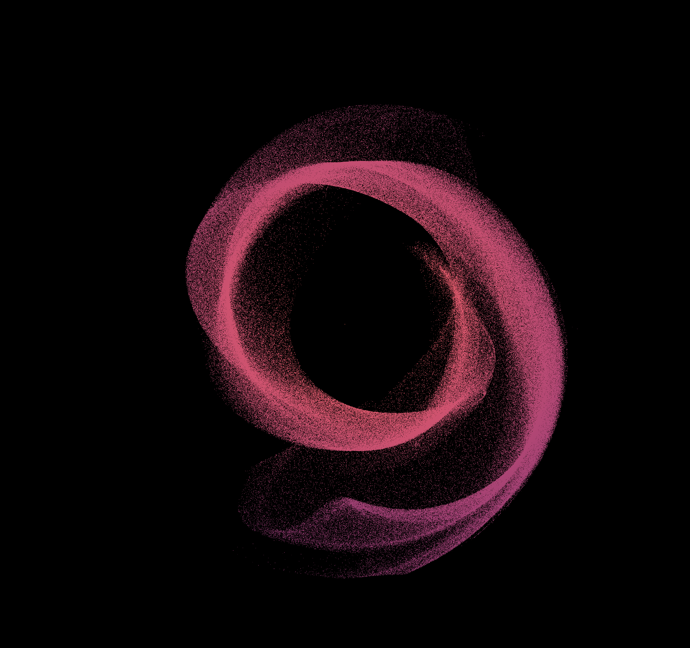
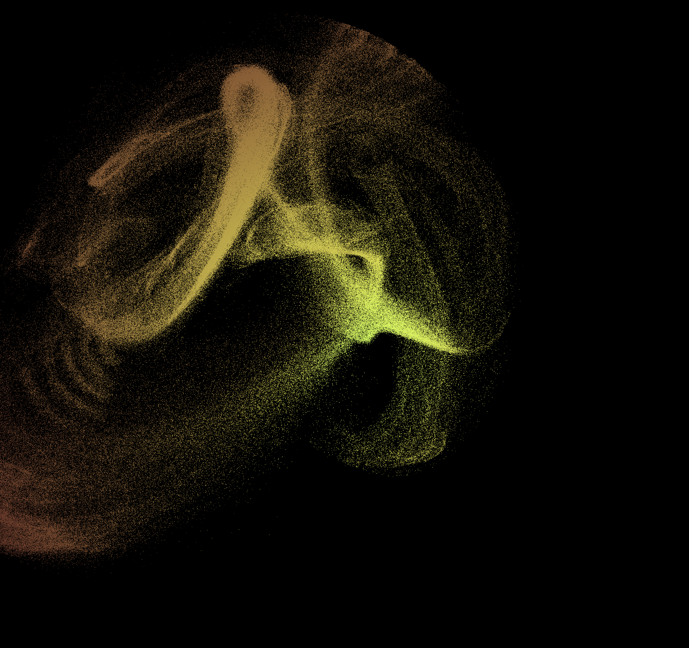

# Particle System

An openCL and openGL simulation of movement of millions of particles in space

## Performance

* Allocate memory directly on GPU without ever use RAM
* Massive parallel computing through kernel with OpenCl, then pass to OpenGL
* Render up to 3,000,000 particles at 60 FPS (run on standard 4 Core iMac) and 10,000,000 particles at 30 FPS

## Features

* Start with either disk (with commend-line flag -s) or square:

* Hue moving with time, key "F" to lock/release hue
* Adjust saturation and value with arrow keys
* adjust background color with keys "QW", "AS" and "ZX" for RGB:

* Mouse scoll-wheel (up-down) to zoom in and out
* Mouse scoll-wheel (left-right) to increase/decrease gravity

* Mouse click to add more gravity points
* Key "C" to release gravity points

* Commend-line arguments to select number of particles
* Key "+", "-" to adjust the size of particles

* Key "E" to stop/resume all gravity (all particles start travelling at current speed)

## Screen Shots

